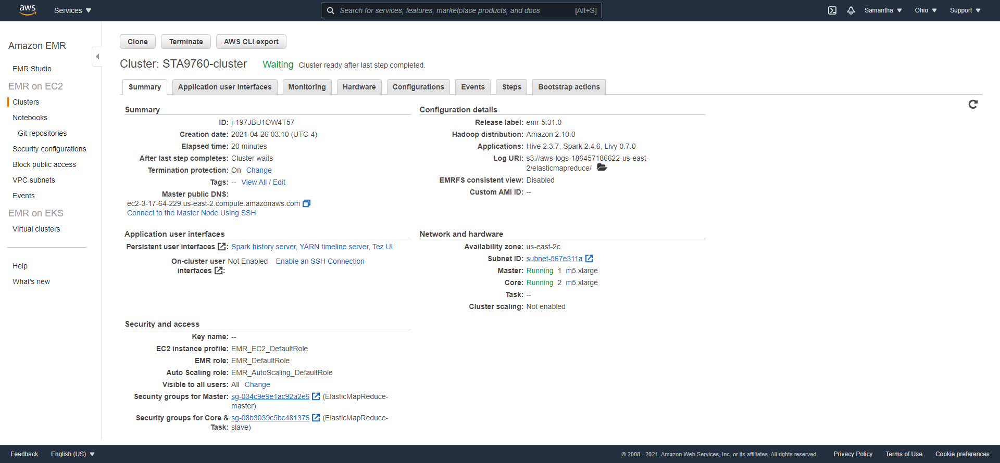
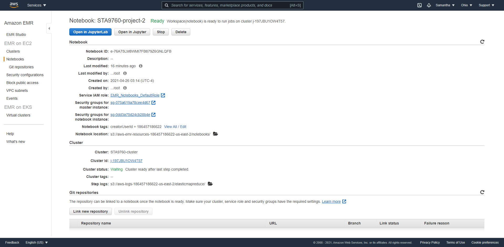

# Analyzing 10Gb of Yelp Reviews Data
In this project, we will analyze a subset of Yelp's business, reviews and user data. This dataset comes from [Kaggle](https://www.kaggle.com/yelp-dataset/yelp-dataset#yelp_academic_dataset_user.json) and have been pulled into a s3 bucket for the purpose of the analysis.

## Analysis
In the analysis we will explore the Yelp's top business categories as well as the user ratings. We will analyze the user reviews as well as elite user reviews and how they compare to the restaurants overall rating. This will provide insights on how reflective Yelp's restaurant ratings are compared to the overall users ratings. For the analysis, we will be using PySpark API and matplotlib, pandas, numpy, and seaborn libraries. 

Below is are screenshots of my cluster configurations and notbook configurations:

